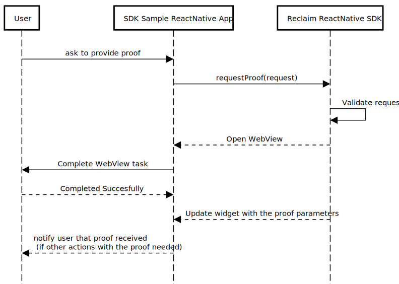
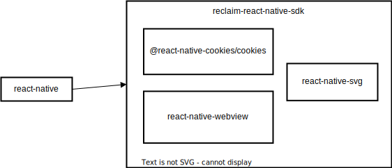

# Reclaim ReactNative SDK v2

Designed to request proofs from the Reclaim protocol and manage the flow of claims.

## Interfaces:

- ### Reclaim Interface

  - #### `requestProof(request: ProofRequest):`

    Requests proof using the provided proof request.

    **Parameters:**

    - `request`: ProofRequest (The proof request object)

- ### ProofRequest Interface

  - **title:** `string` - Title of the request
  - **requestedProofs:** `ProviderV2[]` - Proofs requested by the application
  - **contextMessage?:** `string` - Context message for the proof request
  - **contextAddress?:** `string` - Context address for the proof request (can be zero address)
  - **requestorSignature?:** `string` - Signature of the requestor

- ### ProviderV2 Interface:

  - **headers?:** `Map<string, string>` _(Any additional headers to be sent with the request)_
  - **url:** `string` _(URL to make the request to, e.g., "https://amazon.in/orders?q=abcd")_
  - **method:** `'GET' | 'POST'` _(HTTP method)_
  - **body?:** `string | Uint8Array` _(Body of the request, used only if the method is POST)_
  - **responseRedactions:** `ResponseRedaction[]` _(Portions to select from a response for redaction)_
  - **responseMatches:** `ResponseMatch[]` _(List to check that the redacted response matches provided strings/regexes)_
  - **geoLocation?:** `string` \_(Geographical location from where to proxy the request)

- ### ResponseRedaction Interface:

  - **xPath?:** `string` _(XPath for HTML response)_
  - **jsonPath?:** `string` _(JSONPath for JSON response)_
  - **regex?:** `string` _(Regex for response matching)_

- ### ResponseMatch Interface:

  - **type:** `'regex' | 'contains'` _("regex" or "contains" indicating the matching type)_
  - **value:** `string` _(The string/regex to match against)_

## Usage Flow

## Dependency Diagram

## Error Codes

- `InvalidProofRequest`: The provided proof request is invalid or contains errors.

- `ProofRequestTimeout`: The proof request process timed out without receiving the necessary information.

- `ProofSubmissionFailed`: An error occurred while submitting the proof.

- `InsufficientPermissions`: The application does not have sufficient permissions to perform the requested actions.

- `NetworkError`: A network error occurred during the proof request or submission process.

- `UnexpectedError`: An unexpected error occurred, and the operation could not be completed.

- `UserCanceled`: The user canceled the proof request or submission process.
