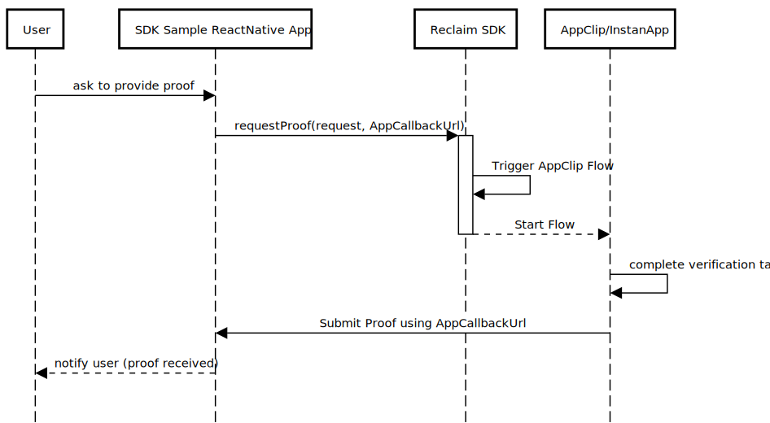
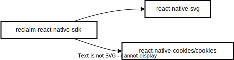

# Reclaim ReactNative SDK v2

Designed to request proofs from the Reclaim protocol and manage the flow of claims.

## Installation

```sh
npm install v2-reclaim-sdk-reactnative
```

## Interfaces:

- ### Reclaim Interface

  - #### `verify(options: VerifyOptions): void`

    Verifies the proof request using specified options. This function will use `buildHttpProviderV2ByIds` first to get requestedProofs `ProviderV2[]`. After that, will build ProofRequest and sign it with the help of `signProofRequest`. Then, it will use `requestProof` to get Linking Url to App Clip/InstantApp. Define event listner to receive the proof from AppClip/InstantApp and invoke callbacks accordingly (use `registerHandlers`). Finally, This function will also handle the redirection to AppClip/InstantApp.

    **Parameters:**

    - `options`: VerifyOptions (Object containing verification options)

  - #### `buildHttpProviderV2ByIds(providerIds: string[]): ProviderV2[]:`

    Queries and returns an array of HTTP providers based on their IDs from Reclaim server.

    **Parameters:**

    - `providerIds`: string[] (Array of provider IDs to build HTTP providers)

    **Returns:**

    - `ProviderV2[]`: Array of built HTTP providers.

  - #### `signProofRequest(request: ProofRequest, privateKey: string): ProofRequest`

    Signs the given ProofRequest with the provided private key, mutating the ProofRequest with the valid signature, and returns the updated ProofRequest.

    **Parameters**

    - `request`: ProofRequest (The proof request object)
    - `privateKey`: string (The private key for generating and verifying the signature)

    **Returns**

    - `ProofRequest`: The mutated `ProofRequest` with a valid signature

  - #### `requestProof(request: ProofRequest): string`

    Requests proof using the provided proof request. handles parsing the request to the deep link. returns a deep link as string to be used for redirection to AppClip/AppInstatnt later.

    **Parameters:**

    - `request`: ProofRequest (The proof request object)

  - #### `registerHandlers(options: HandlersOptions): void`

    Registers a custom event handler for deep link events. When a deep link is received, the registered handler will be invoked with the deep link URL.

    **Parameters:**

    - `options`: HandlersOptions (Object containing event handler options)

- ### VerifyOptions Interface

  - **providerIds**: Array of strings representing provider IDs used in the verification process.
  - **onSuccessCallback**: Function that takes an array of proofs as a parameter, executed on successful verification.
  - **onFailureCallback**: Optional function that takes an error as a parameter, executed on verification failure.
  - **privateKey**: String representing the private key used for signature generation and verification.
  - **contextAddress**: Optional string representing the context address for the proof request.
  - **contextMessage**: Optional string representing the context message for the proof request.

- ### HandlersOptions Interface

  The `HandlersOptions` interface defines the options that can be provided when registering custom event handlers for deep link events.

  **Parameters**

  - **onSuccessCallback (optional):**

    - Type: `(proofs: Proof[]) => void`
    - Description: A callback function that will be invoked when the deep link event is successful. It receives an array of proofs as a parameter.

  - **onFailureCallback (optional):**

    - Type: `(error: Error) => void`
    - Description: A callback function that will be invoked when the deep link event encounters an error. It receives an `Error` object as a parameter.

- ### ProofRequest Interface

  - **title:** `string` - Title of the request
  - **requestedProofs:** `ProviderV2[]` - Proofs requested by the application
  - **contextMessage?:** `string` - Context message for the proof request
  - **contextAddress?:** `string` - Context address for the proof request (can be zero address)
  - **requestorSignature?:** `string` - Signature of the requestor
  - **appCallbackUrl**: `string` - callback url(deep link) which will receive the proof from AppClip/InstantApp

- ### Provider V2

  - **name:** string
  - **logoUrl:** string
  - **url:** string
  - **urlType:** string
  - **Method:** GET | POST
  - **Body:** Object | null
  - **loginURL:** string
  - **loginCookies:** string[]
  - **loginHeaders:** string[]
  - **isActive:** boolean
  - **responseSelections:** Object[]
    - JSON Path: string
    - XPath: string
    - Response Match: string
  - **completedTrigger:** string
  - **customInjection:** string
  - **Body Sniff:** Object
    - Enabled: false
    - Regex: "(.\*?)"
  - **userAgent:** string | null
  - **isApproved:** boolean

- ### ResponseRedaction Interface:

  - **xPath?:** `string` _(XPath for HTML response)_
  - **jsonPath?:** `string` _(JSONPath for JSON response)_
  - **regex?:** `string` _(Regex for response matching)_

- ### ResponseMatch Interface:

  - **type:** `'regex' | 'contains'` _("regex" or "contains" indicating the matching type)_
  - **value:** `string` _(The string/regex to match against)_

## Usage Flow



## Dependency Diagram



## Error Codes

- `InvalidProofRequest`: The provided proof request is invalid or contains errors.

- `ProofRequestTimeout`: The proof request process timed out without receiving the necessary information.

- `ProofSubmissionFailed`: An error occurred while submitting the proof.

- `InsufficientPermissions`: The application does not have sufficient permissions to perform the requested actions.

- `NetworkError`: A network error occurred during the proof request or submission process.

- `UnexpectedError`: An unexpected error occurred, and the operation could not be completed.

- `UserCanceled`: The user canceled the proof request or submission process.

## Usage Example

Here's a step-by-step guide on how to utilize the Reclaim ReactNative SDK v2 effectively without using the simplified `verify` function.

```typescript
const privateKey = 'YOUR_PRIVATE_KEY'

// Build HTTP providers by IDs
const providerIds = ['id1', 'id2']
const httpProviders = buildHttpProviderV2ByIds(providerIds)

// Create a ProofRequest based on the obtained HTTP providers
const proofRequest: ProofRequest = {
  title: 'Example Proof Request',
  requestedProofs: httpProviders,
  contextMessage: 'Please provide the necessary proofs for verification.',
  contextAddress: '0x0',
  appCallbackUrl: Linking.getInitialUrl(),
}

// Sign the ProofRequest with the provided private key
const proofRequestWithSignature = signProofRequest(proofRequest, privateKey)

// Get the deep link to the AppClip/InstantApp with the request data
const deepLink = requestProof(proofRequestWithSignature)

// Register custom handlers for deep link events
registerHandlers({
  onSuccessCallback: proofs => {
    console.log('Proofs received:', proofs)
    // Perform actions on successful verification
  },
  onFailureCallback: error => {
    console.error('Verification failed:', error)
    // Perform actions on verification failure
  },
})

Linking.openURL(deepLink) // redirecting to the App Clip
```

## License

MIT
